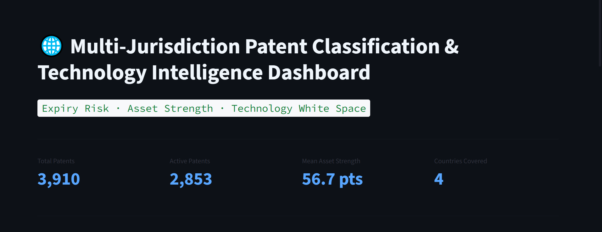
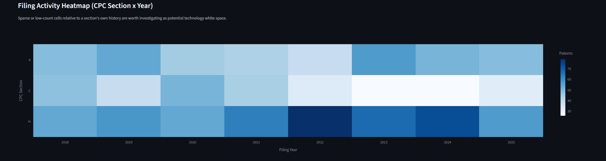

# Multi-Jurisdiction Patent Classification & Technology Intelligence Dashboard

An interactive dashboard analyzing ~3,900 granted patents across four technology
domains (Pharmaceutical, Water Treatment, Metallurgy & Alloys, Electrochemical)
and four countries (US, China, South Korea, Japan), built on real data sourced
from Google's Patents Public Datasets on BigQuery.

**Live demo:** https://patent-intelligence-dashboard.streamlit.app



## Why this project

This project connects two things directly: 11 years of professional experience
classifying and indexing patent documents across technical domains (and across
US, Chinese, Korean, and Japanese filings), and a transition into data analytics.
The domain scope and classification logic in this dashboard are built the same
way a patent classification specialist would define them — by CPC (Cooperative
Patent Classification) code, not by keyword guesswork.

## The three questions this dashboard answers

1. **R&D Expiry & Generic-Entry Window** — which active patents are approaching
   expiry, broken down by year, domain, and country.

   

2. **Patent Asset Strength & Risk** — a composite score (years of protection
   remaining, weighted by technical breadth) ranking companies by portfolio
   strength.

   

3. **Technology White-Space Analysis** — filing activity by CPC section over
   time, to help spot technology areas with comparatively low recent activity.

   

## Data pipeline

```
BigQuery (patents-public-data) → SQL extraction/classification → CSV export
    → Pydantic validation → pandas transformation → Streamlit dashboard
```

- **Source**: `patents-public-data.patents.publications` and
  `patents-public-data.google_patents_research.publications` (Google Patents
  Public Datasets, CC BY 4.0, via IFI CLAIMS Patent Services).
- **Domain classification**: patents are tagged by CPC code prefix (e.g.
  `A61K`/`A61P` → Pharmaceutical, `C02F` → Water Treatment, `C21`/`C22` →
  Metallurgy & Alloys, `H01M`/`C25` → Electrochemical) — the same
  classification-first approach used in professional patent indexing, rather
  than keyword matching on titles (which produces false positives — e.g.
  "electrochemical" also matches unrelated title text like "electro**chemical**
  vapor deposition").
- **Sampling**: stratified by country and filing year (2000–2025) to keep the
  dataset representative across two decades rather than skewed toward recent
  filings.
- **Validation**: every record is checked against a Pydantic schema
  (`models.py`) before it reaches the dashboard; malformed rows are logged and
  skipped rather than crashing the app.

## Known limitations (stated plainly, not hidden)

- **Estimated expiry, not authoritative**: expiry is calculated as filing date
  + 20 years (the standard US utility patent term). Real terms can differ due
  to patent term adjustments, terminal disclaimers, or maintenance-fee lapses.
  This is a reasonable analytical estimate, not a legal determination.
- **Japan is underrepresented** in this sample relative to the other three
  countries, due to lower English-title/metadata coverage for Japanese filings
  in this particular BigQuery dataset — not a filtering error.
- **CPC-based classification can still miscategorize edge cases** — a small
  number of patents (~1%) span more than one domain (e.g. a battery-electrode
  alloy touches both Metallurgy & Alloys and Electrochemical); the dashboard
  uses the first-listed domain as primary for single-category charts.
- **"Asset Strength Score" is an analytical proxy**, not a financial or legal
  valuation. It combines years-of-protection-remaining and CPC code breadth
  (a rough proxy for technical scope) — deliberately excluding jurisdiction
  count, since this dataset doesn't track multi-country filings per patent
  family.

## Tech stack

Python · Streamlit · Pandas · Plotly · Pydantic · Google BigQuery (SQL)

## Project structure

```
app.py                 Dashboard entry point
config.py               File path configuration
models.py                Pydantic schema / domain logic
data/ingestion.py         Data loading & validation (cached)
services/valuation.py     Scoring & analysis logic (Q1/Q2/Q3)
ui/charts.py               Plotly chart builders
ui/styles.py                Dashboard theming
data_files/                 Source CSV/XLSX exports (see BigQuery queries below)
```

## Running locally

```bash
pip install -r requirements.txt
streamlit run app.py
```

## BigQuery source query (abridged)

The core extraction query classifies patents by CPC prefix and samples
stratified by country/year. Full query available in `/sql/` — happy to share
on request.
